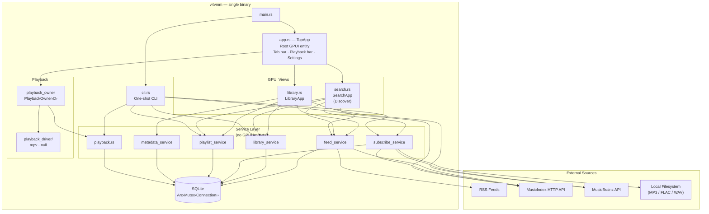
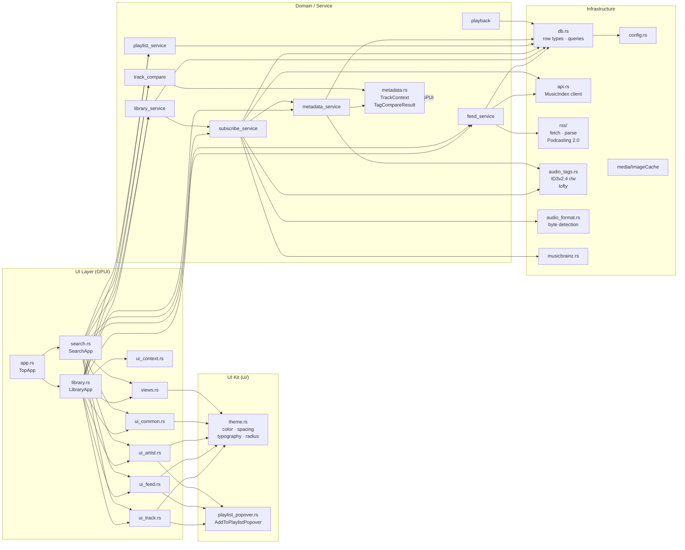
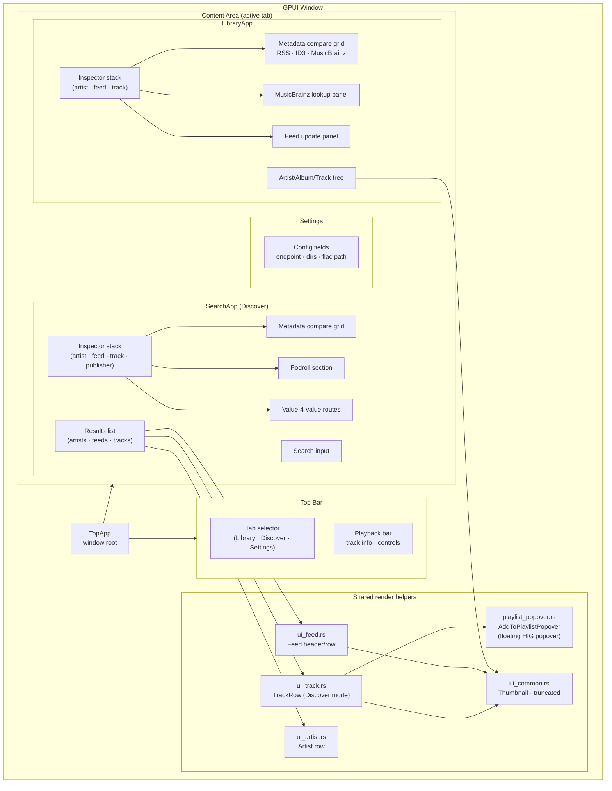
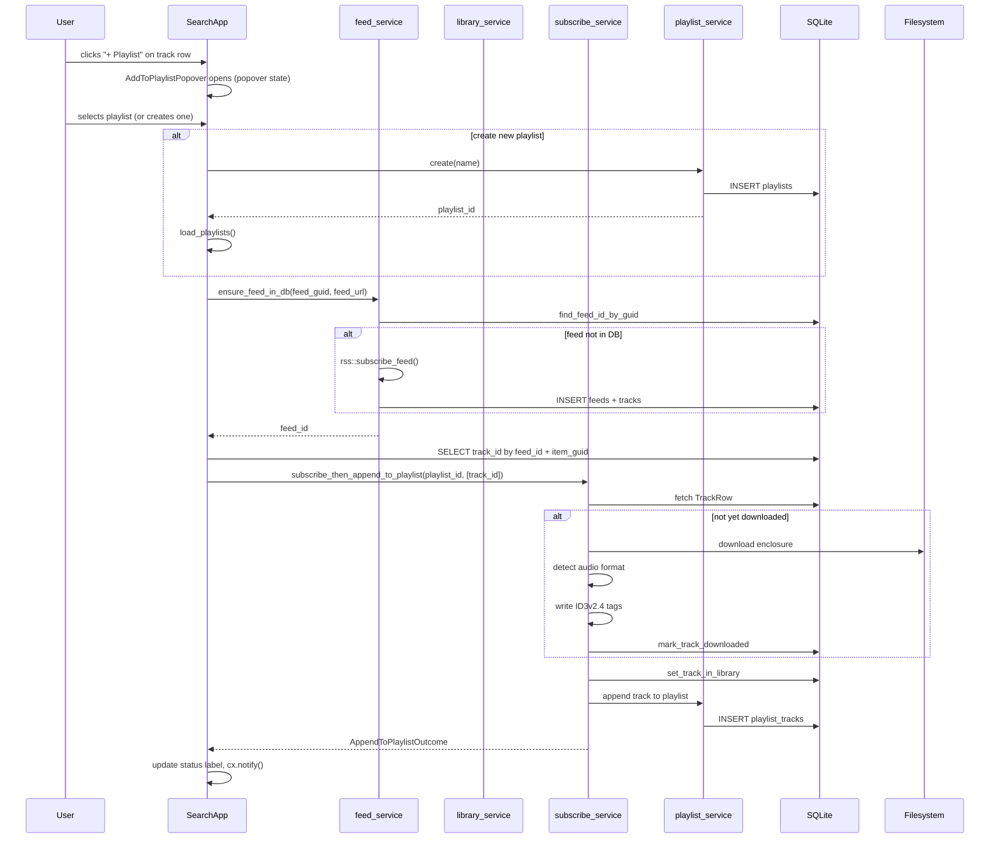
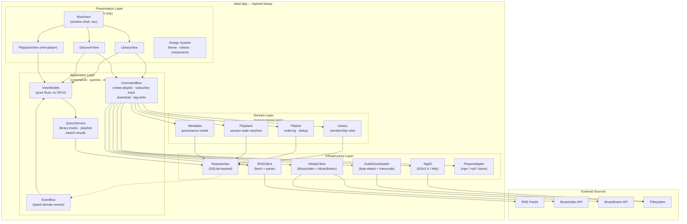
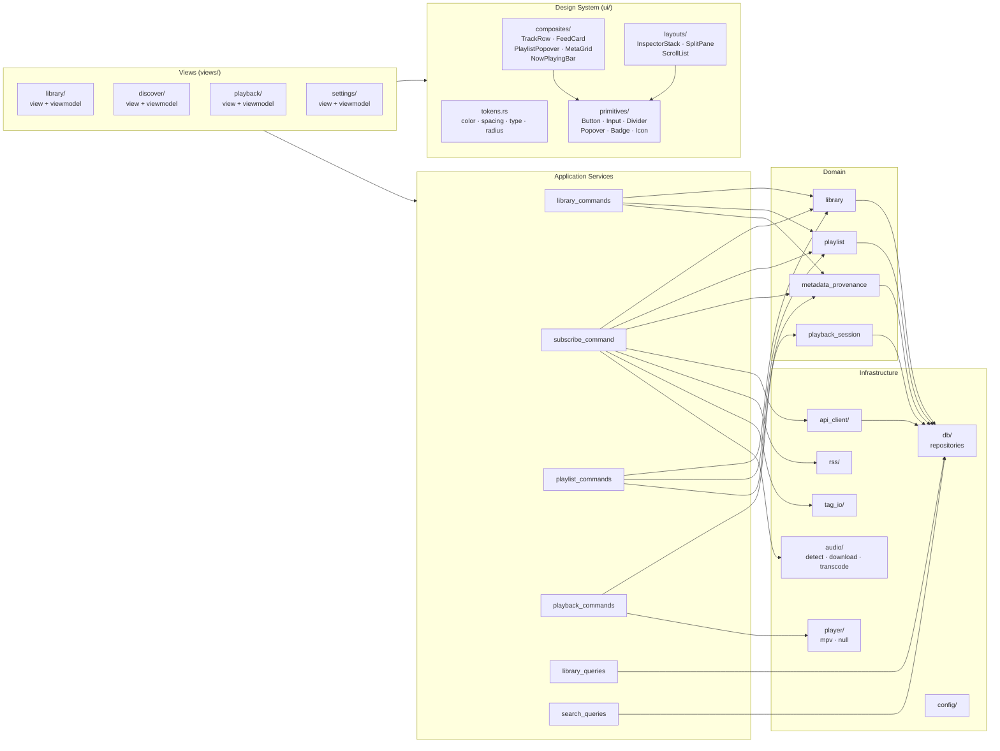
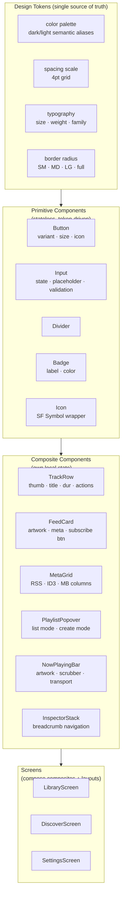
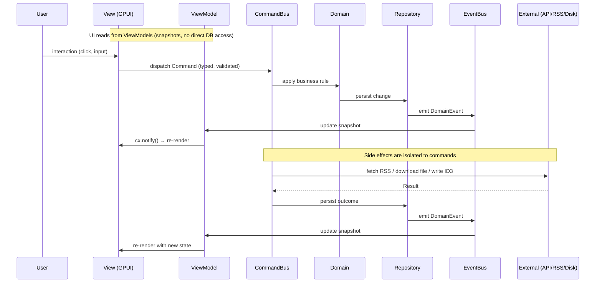

# v4vmm Architecture Diagrams

Two views: the **current state** of the codebase, then an **ideal target** for an app of this kind.

---

## 1 — Current Architecture

### 1.1 System Overview

---

### 1.2 Module Relationships

---

### 1.3 UI Component Hierarchy

---

### 1.4 Key Call Flows

---

## 2 — Ideal Architecture

### 2.1 System Overview

---

### 2.2 Ideal Module Relationships

---

### 2.3 Ideal UI Component Hierarchy

---

### 2.4 Ideal Data Flow (Reactive)

---

## Key Differences: Current vs Ideal

| Concern | Current | Ideal |
|---|---|---|
| **State location** | `SearchApp` / `LibraryApp` hold all state | ViewModels hold read snapshots; domain owns write state |
| **Service calls** | Direct `&mut self` methods dispatch inline | CommandBus decouples dispatch from execution |
| **UI reuse** | Ad-hoc render functions, 4 duplicate inline panels | Design system: tokens → primitives → composites → screens |
| **Reactivity** | `cx.notify()` called manually after each mutation | EventBus propagates domain events to all interested VMs |
| **GPUI boundary** | Partially enforced (ADR 0022 in progress) | Hard boundary: no `gpui` import below Application layer |
| **Error handling** | `self.status = format!(...)` strings | Typed error events surfaced via EventBus → toast/banner |
| **Playback** | `PlaybackOwner<D>` generic in root | `PlayerAdapter` trait in Infra; domain state machine independent |
| **CLI** | Shares service functions with UI directly | Shares CommandBus and QueryService — same path as UI |
| **Theme** | Constants in `ui/theme.rs` | Design tokens with semantic aliases + dark/light switching |
