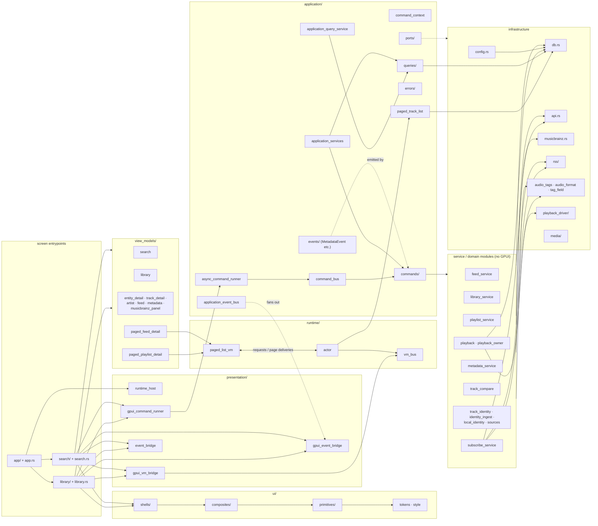
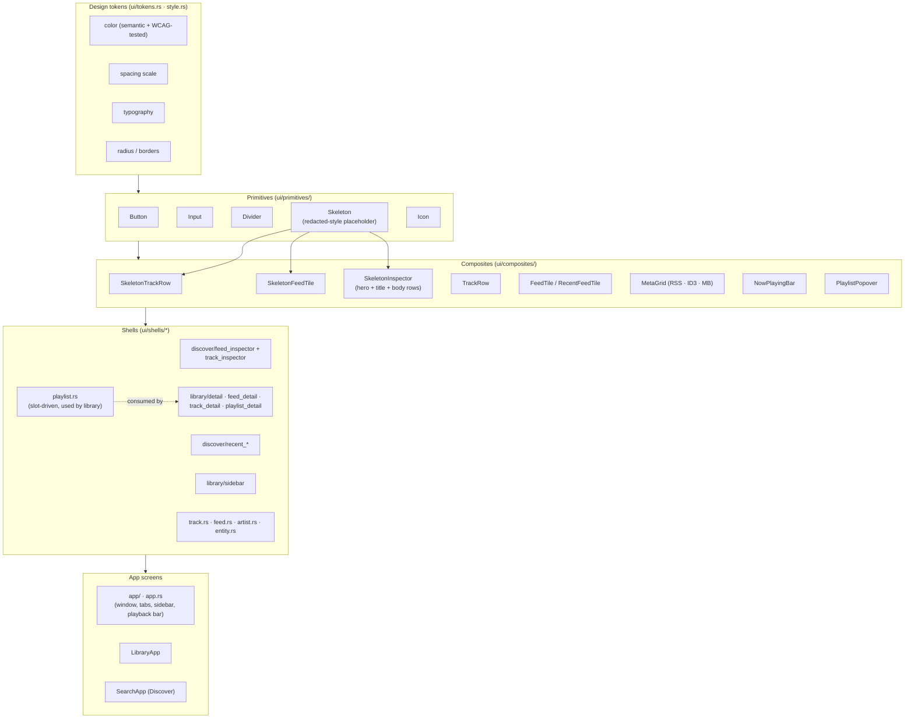
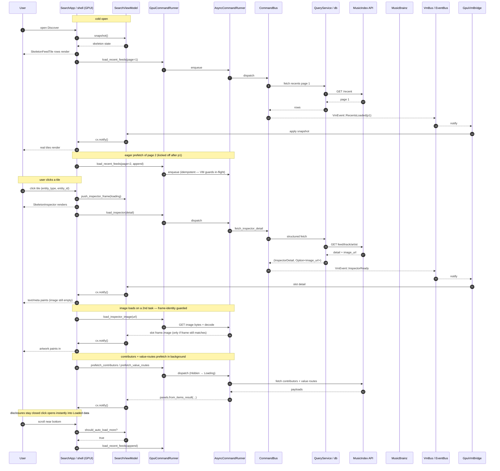
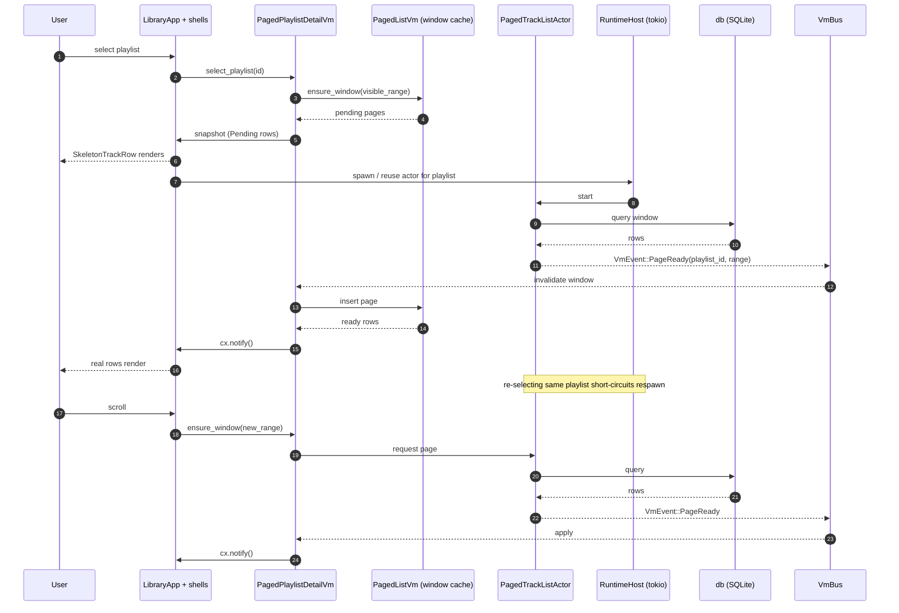

# v4vmm Architecture — Current Snapshot

A focused snapshot of where the codebase actually is **today**, after the
async-runtime / paged VM / layer-consolidation work shipped under ADRs 0040,
0041, and 0042. For the original side-by-side `current-vs-ideal` view, see
[`architecture-diagrams.md`](./architecture-diagrams.md). This file is the
"what we have right now" reference and is the one to keep in sync with
`src/`.

> **Conventions used below**
> - Solid arrows = synchronous call / direct dependency.
> - Dashed arrows = asynchronous publish/subscribe (events).
> - Crate-internal modules are referenced by their `src/` path.

---

## 1. System Overview

```mermaid
graph TD
    subgraph External["External Sources"]
        RSS["RSS Feeds"]
        MI["MusicIndex API"]
        MB["MusicBrainz API"]
        FS["Filesystem<br/>(audio + ID3)"]
        MPV["mpv (IPC)"]
    end

    subgraph Presentation["Presentation Layer (GPUI)"]
        AppShell["app.rs<br/>window + tabs + sidebar"]
        Library["library/<br/>LibraryApp"]
        Search["search/<br/>SearchApp (Discover)"]
        Shells["ui/shells/*<br/>library · discover · playlist · track"]
        Composites["ui/composites/*<br/>SkeletonInspector · TrackRow ·<br/>FeedTile · MetaGrid · NowPlayingBar"]
        Primitives["ui/primitives/*<br/>Button · Input · Skeleton · Divider"]
        Tokens["ui/tokens.rs · ui/style.rs<br/>color · spacing · type"]
    end

    subgraph PresAdapters["Presentation Adapters (presentation/)"]
        RuntimeHost["RuntimeHost<br/>tokio + VmBus owner"]
        GpuiCmd["GpuiCommandRunner"]
        GpuiVm["GpuiVmBridge"]
        EvBridge["GpuiEventBridge"]
    end

    subgraph VMs["ViewModels (view_models/)"]
        SearchVM["SearchViewModel"]
        LibraryVM["LibraryViewModel"]
        PagedPlaylistVM["PagedPlaylistDetailVm"]
        PagedFeedVM["PagedFeedDetailVm"]
        EntityVM["entity_detail · track_detail ·<br/>artist · feed · metadata"]
    end

    subgraph Application["Application Layer (application/)"]
        CmdBus["CommandBus"]
        AsyncRunner["AsyncCommandRunner<br/>publishes VmEvents"]
        QuerySvc["ApplicationQueryService"]
        EvBus["ApplicationEventBus"]
        Cmds["commands/*<br/>subscribe · playlist · playback · tag"]
        Queries["queries/*"]
        Ports["ports/*<br/>(trait boundaries)"]
    end

    subgraph Runtime["Runtime (runtime/)"]
        VmBus["VmBus<br/>typed VmEvent fan-out"]
        PagedActor["PagedTrackListActor<br/>(per playlist/feed)"]
        PagedVm["PagedListVm<br/>windowed cache"]
        Actor["actor.rs · mod.rs<br/>scaffold + lifecycle"]
    end

    subgraph DomainSvc["Domain / Service Modules (no GPUI)"]
        FeedSvc["feed_service"]
        LibSvc["library_service"]
        PlaylistSvc["playlist_service"]
        SubSvc["subscribe_service"]
        MetaSvc["metadata_service"]
        Compare["track_compare"]
        Identity["track_identity ·<br/>identity_ingest · local_identity"]
    end

    subgraph Infra["Infrastructure"]
        DB["db.rs<br/>SQLite + migrations"]
        Api["api.rs<br/>MusicIndex client"]
        MbMod["musicbrainz.rs"]
        RssMod["rss/"]
        Tags["audio_tags.rs +<br/>audio_format.rs"]
        Sources["sources.rs"]
        Playback["playback.rs +<br/>playback_owner.rs"]
        Driver["playback_driver/<br/>mpv IPC"]
        Cfg["config.rs"]
        Media["media/<br/>image cache"]
    end

    AppShell --> Library & Search
    Library & Search --> Shells --> Composites --> Primitives --> Tokens

    AppShell --> RuntimeHost
    Library & Search --> GpuiCmd & GpuiVm & EvBridge
    GpuiCmd --> AsyncRunner
    GpuiVm --> VmBus
    EvBridge --> EvBus

    Library & Search --> VMs
    VMs --> PagedVm
    PagedVm <-->|window requests + invalidations| PagedActor

    AsyncRunner --> CmdBus
    CmdBus --> Cmds
    Cmds --> DomainSvc
    QuerySvc --> Queries --> DomainSvc

    DomainSvc --> DB & Api & MbMod & RssMod & Tags & Sources
    SubSvc --> Tags & RssMod & Api
    Playback --> Driver --> MPV
    Playback --> DB

    Api --> MI
    MbMod --> MB
    RssMod --> RSS
    Tags --> FS
    Media --> FS

    PagedActor -. VmEvent::PageReady .-> VmBus
    AsyncRunner -. VmEvent::TrackChanged / Invalidate .-> VmBus
    Cmds -. MetadataEvent .-> EvBus
    EvBus -. typed events .-> EvBridge

    Cfg --> DB
```

**What changed vs the "current" snapshot in `architecture-diagrams.md`:**

- A real **Application layer** exists: `CommandBus`, `AsyncCommandRunner`,
  `ApplicationQueryService`, `ApplicationEventBus`, `commands/`, `queries/`,
  `ports/`.
- A **Runtime layer** carries async work off the foreground executor:
  `RuntimeHost` owns the tokio runtime and a typed `VmBus`; per-listing
  `PagedTrackListActor`s feed `PagedListVm` windowed caches.
- **Presentation adapters** (`presentation/`) bridge GPUI to the
  Application/Runtime layers without leaking GPUI types into either.
- The **UI is layered**: `tokens → primitives → composites → shells →
  app screens`. Skeletons are first-class composites used while VMs are
  in a loading state.
- The metadata model (`metadata.rs`) is GPUI-free per ADR 0022; cover art
  travels as `ImageBytes`, never `Arc<gpui::Image>`.

---

## 2. Module Relationships (data dependencies)

---

## 3. UI Composition (after ADR 0042)

The library detail surface currently has its **own** dispatcher
(`ui/shells/library/detail.rs`) and only its `playlist_detail` variant
goes through the slot-driven `playlist.rs` shell. Bringing the rest of
the library variants onto that shell is filed as
`library-uses-playlist-shell`.

---

## 4. Sequence — Discover open + inspector with eager prefetch

This is the path users see today on the Discover surface, including the
ADR 0040/0041 reactive loop and the recent perceived-latency work.

---

## 5. Sequence — Library cold open via paged actor

Library detail goes through the `RuntimeHost` + `PagedTrackListActor`
path under `--features async-runtime` (default).

---

## 6. Where the ideal architecture is **already true** vs **still pending**

| Concern | Ideal (target) | Current state |
|---|---|---|
| Layered package structure | `presentation / application / domain / infrastructure` | ✅ All four layers exist as crates-of-modules; `application/` and `runtime/` are real |
| GPUI boundary | No `gpui` import below presentation | ✅ Enforced for `metadata.rs`, services, application, runtime; ❗ `library.rs` and `search.rs` still hold non-trivial logic next to render code |
| CommandBus | All UI writes go through a typed bus | ✅ `CommandBus` + `AsyncCommandRunner` in place; ❗ a few legacy direct service calls remain in screens |
| EventBus | Domain events fan out to VMs | ✅ `ApplicationEventBus` + `VmBus`; `MetadataEvent::TrackTagged` → `VmEvent::TrackChanged` shipped |
| ViewModels as snapshot source | Views read VM snapshots only | ✅ Discover and library go through VMs; ❗ a few inspector-frame fields are still mutated from screen impl files |
| Paged / windowed lists | Windowed VMs over actors | ✅ `PagedListVm` + `PagedTrackListActor` for playlist & feed listings |
| Skeleton-first rendering | Loading states render placeholders, never raw text | ✅ Recents, track lists, and inspectors all render skeletons; auto-pagination wired |
| Eager prefetch | Latency hidden by background hydration | ✅ Recents page 2, inspector image, inspector contributors + value routes |
| Sidebar full-collapse + reflow | HIG-compliant split view | ❌ Tracked as `sidebar-full-collapse` and `sidebar-content-reflows-on-resize` |
| Unified library/playlist shell | One slot-driven shell | ⚠️ Playlist variant uses `playlist.rs` shell; other library variants still use bespoke renderers (`library-uses-playlist-shell`) |
| Artist N+1 fetch | Parallel feed hydration | ❌ Filed as `discover-artist-parallel-feed-fetch` |

---

## File map (where things live)

| Concern | Files |
|---|---|
| Application layer | `src/application/{command_bus,async_command_runner,application_event_bus,application_query_service,application_services,command_context,paged_track_list}.rs`, `src/application/{commands,queries,events,errors,ports}/` |
| Runtime layer | `src/runtime/{actor,vm_bus,paged_list_vm,mod}.rs` |
| Presentation adapters | `src/presentation/{runtime_host,gpui_command_runner,gpui_vm_bridge,gpui_event_bridge,event_bridge}.rs` |
| ViewModels | `src/view_models/*.rs` |
| Screens | `src/app.rs`, `src/app/`, `src/library.rs`, `src/library/`, `src/search.rs`, `src/search/` |
| UI design system | `src/ui/{tokens,style}.rs`, `src/ui/{primitives,composites,shells,layouts}/` |
| Domain / services | `src/{feed,library,playlist,subscribe,metadata}_service.rs`, `src/{track_compare,track_identity,identity_ingest,local_identity,sources,playback,playback_owner}.rs` |
| Infrastructure | `src/{db,api,musicbrainz,audio_tags,audio_format,tag_field,config}.rs`, `src/{rss,playback_driver,media}/` |
